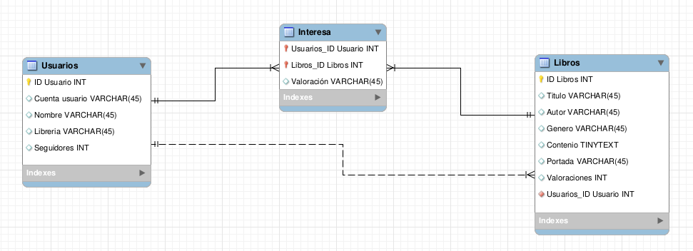

# Bookito

## Especificación del proyecto

### Introducción
* **Titulo proyecto:** Bookito
* **Objetivos:** Ejecutar una aplicación que simula una libreria
* **Descripción:** Una web donde la gente pueda subir libros propios para que el resto de usuarios pueda leerlos y dar su opinion. La gente al registrarse podrá leer libros de otros usuarios, o bien escribir alguna obra propia.
* **Desenvolupador:** Javiera Cifuentes
* **Github:** https://github.com/2ASIX2018/Bookito

### Diseño
#### Esquema
El esquema de base de datos es el siguiente:

